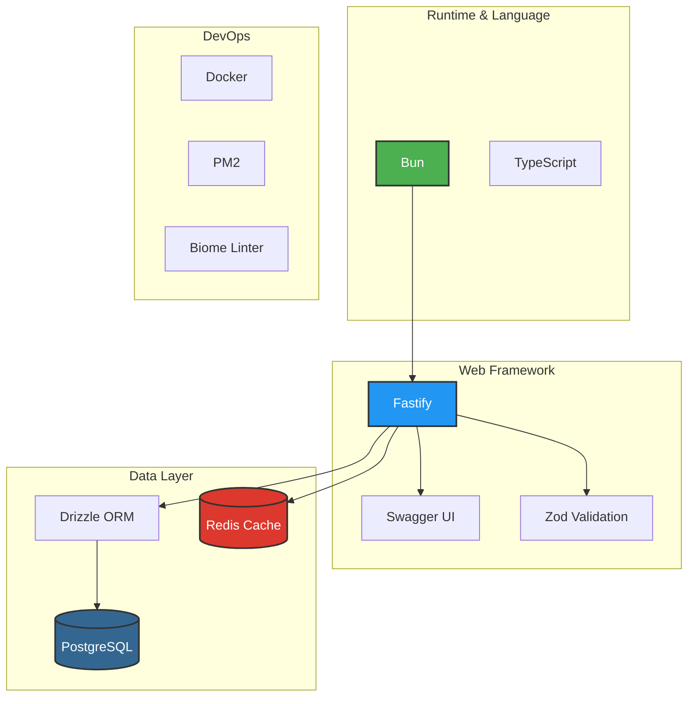
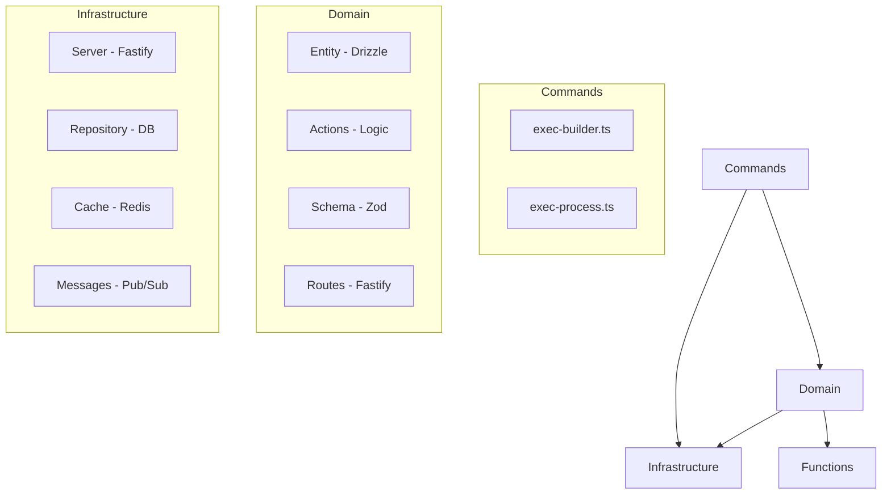
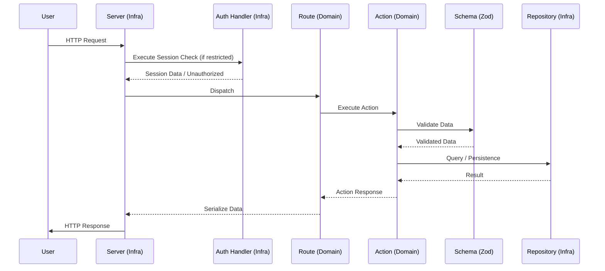

This project follows a clean, modular architecture inspired by Domain-Driven Design (DDD) principles, focused on performance and developer productivity using TypeScript and Bun.

## Technology Stack

## Layer Overview

### 1. Commands (`src/commands/`)
The entry point of the application. It handles process management (via PM2), building, and bootstrapping. It also hosts the **Zero-Dep Template Engine** for domain scaffolding.

### 2. Domain (`src/domain/`)
The heart of the application. Each subfolder (e.g., `user`) represents a bounded context and contains:
- **actions**: The actually business logic handlers.
- **entity**: Data models and database table definitions.
- **schema**: Input validation and output serialization using Zod.
- **routes**: Fastify route definitions.

### 3. Infrastructure (`src/infrastructure/`)
Contains implementation details of technical services:
- **Server**: Fastify configuration and boilerplate.
- **Cache**: Redis integration for high-performance data storage.
- **Repository**: Database connection and base repository patterns.
- **Messages**: Communication layer (distributed via Redis or internal via Node events).
- **Plugins**: Agent system for modular extensions (e.g., Authentication).

## Request Flow

When an HTTP request arrives, it follows this path:

1. **Fastify Server** (Infrastructure) receives the request.
2. **Request Transform** converts raw data and identifies the language/token.
3. **Route** (Domain) matches the path and calls the appropriate **Action**.
4. **Action** (Domain) validates input using **Schema** (Domain/Zod).
5. **Action** interacts with **Repository** or **Cache** (Infrastructure) to fetch/persist data.
6. **Action** returns the response, which is then serialized by the **Route**.

