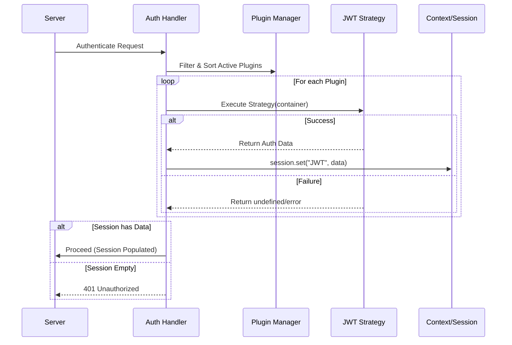

# Plugins & Agents System

The boilerplate introduces a **Plugin/Agent System** to handle cross-cutting concerns and feature extensions in a modular way. This allows you to "plug in" functionality like authentication, logging, or other middleware-like behaviors without cluttering the core request handling logic.

## Concept

- **Agent**: A category consisting of one or more plugins (e.g., `authentication`).
- **Plugin**: A specific implementation of a strategy (e.g., `JWT`, `OAuth`).
- **Container**: The context passed to plugins, containing the request state (headers, body, etc.).

## Configuration

Plugins are configured in `src/infrastructure/settings/plugins.ts`. Each plugin can be toggled `active` and assigned a `priority`.

```typescript
// src/infrastructure/settings/plugins.ts
import jwt from "@infrastructure/authentication/strategies/jwt";

export default {
    authentication: {
        JWT: {
            priority: 1,      // Lower numbers run first
            active: true,     // Enable/Disable
            strategy: jwt.session, // The function to execute
        },
    },
}
```

## Request Flow

When a request is marked as `restricted` (requiring authentication/plugins), the system iterates through active plugins for the `authentication` agent, sorted by priority.



## How to Add a New Plugin

1.  **Define the Strategy**: Create a function that accepts a `container` and returns data or throws an error.
2.  **Register**: Add it to `src/infrastructure/settings/plugins.ts`.
3.  **Use**: The data returned by the strategy is available in `request.session()`.

### Example Strategy

```typescript
async function myCustomAuth(request: container) {
    const key = request.headers()["x-api-key"];
    if (key === "secret") return { user: "admin" };
    throw new Error("Invalid Key");
}
```
