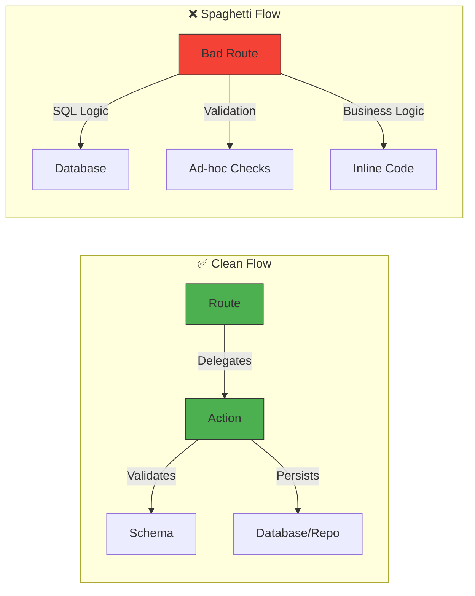
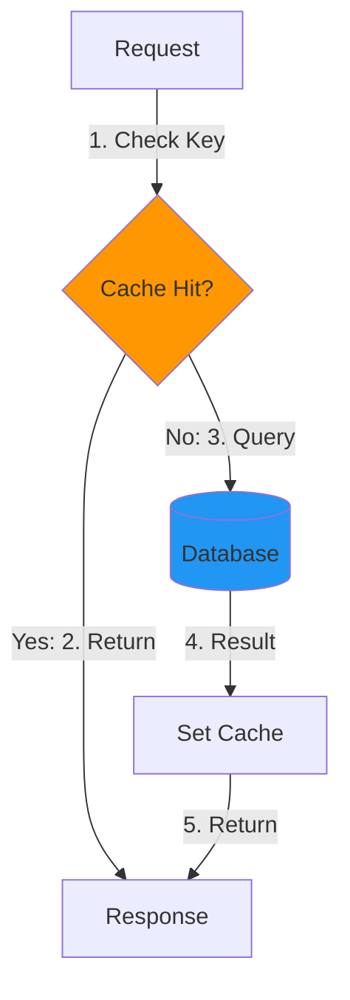

# Best Practices

This guide outlines recommended patterns and practices when working with this boilerplate.

## Domain Design

### Keep Actions Focused

Each action should have a single responsibility:

```typescript
// ✅ Good: Single responsibility
export default async function postNewEntity(request: container) {
	// 1. Validation
	// 2. Business logic
	// 3. Persistence
	// 4. Return result
}

// ❌ Bad: Multiple responsibilities
export default async function handleUserStuff(request: container) {
	// Creates user, sends email, updates analytics, logs...
}
```

### Use Value Objects for Complex Types

```typescript
// ✅ Good: Encapsulated validation
class Email extends ValueObject<string> {
	static create(value: string): Email {
		const result = z.string().email().safeParse(value);
		if (!result.success) throw new Error("Invalid email");
		return new Email(result.data);
	}
}

// ❌ Bad: Scattered validation
if (!email.includes("@")) throw new Error("Bad email");
```

## Caching Strategy

### When to Cache

✅ **DO cache:**
- Frequently accessed data (user profiles, settings)
- Data that changes infrequently
- Expensive computations or queries

❌ **DON'T cache:**
- Real-time data (inventory, prices)
- User-specific sensitive data without encryption
- Data that changes on every request

### Cache Invalidation Pattern

```typescript
// ✅ Good: Invalidate related caches
await cache.json.del(tag("user", "find*"));
await cache.json.del(tag("user", `find{id}`, { id: userId }));

// ❌ Bad: Forget to invalidate
// User data is now stale in cache!
```

### Cache TTL Guidelines

```typescript
// Short-lived (1-5 minutes): Real-time-ish data
await cache.json.set(key, data, 60 * 5);

// Medium-lived (10-30 minutes): Semi-static data
await cache.json.set(key, data, 60 * 10);

// Long-lived (1-24 hours): Static data
await cache.json.set(key, data, 60 * 60 * 24);
```

## Database Queries

### Use Prepared Statements for Repeated Queries

```typescript
// ✅ Good: Prepared statement (compiled once, executed many times)
const prepare = repository
	.select()
	.from(entity)
	.where(eq(entity.id, sql.placeholder("id")))
	.prepare("/unique-name");

const result = await prepare.execute({ id });

// ❌ Bad: Dynamic query every time
const result = await repository
	.select()
	.from(entity)
	.where(eq(entity.id, id));
```

### Optimize Pagination

```typescript
// ✅ Good: Use withPagination helper
withPagination(query, page, limit);

// ❌ Bad: Manual offset/limit
query.offset((page - 1) * limit).limit(limit);
```

### Select Only What You Need

```typescript
// ✅ Good: Select specific columns
const { password, ...publicFields } = getTableColumns(user);
const result = await repository.select(publicFields).from(user);

// ❌ Bad: Select everything
const result = await repository.select().from(user);
// Now you have to manually remove password!
```

## Error Handling

### Use Proper HTTP Status Codes

```typescript
// ✅ Good: Semantic status codes
if (!validRequest.success) throw request.badRequest(lang, "validation_failed"); // 400
if (!found) throw request.notFound(lang, "user_not_found"); // 404
if (!authorized) throw request.forbidden(lang, "access_denied"); // 403
if (!completed) throw request.conflict(lang, "resource_conflict"); // 409

// ❌ Bad: Generic errors
throw new Error("Something went wrong"); // 500
```

### Provide i18n Error Messages

```typescript
// ✅ Good: Translatable error keys
throw request.badRequest(request.language(), "email_already_exists");

// ❌ Bad: Hardcoded messages
throw new Error("Email already exists");
```

## Testing

### Follow AAA Pattern

```typescript
// ✅ Good: Arrange-Act-Assert
it("should return user when valid ID is provided", async () => {
	// Arrange
	const userId = "123";
	mockRepo.getById.mockResolvedValue(mockUser);
	
	// Act
	const result = await userService.getById(userId);
	
	// Assert
	expect(result).toEqual(mockUser);
});
```

### Test Business Logic, Not Infrastructure

```typescript
// ✅ Good: Test domain logic
it("should hash password before storing", async () => {
	const plainPassword = "secret123";
	await createUser({ password: plainPassword });
	expect(hashFunction).toHaveBeenCalledWith(plainPassword);
});

// ❌ Bad: Test Drizzle ORM (already tested by library)
it("should insert into database", async () => {
	// Testing library behavior, not your code
});
```

## Security

### Never Log Sensitive Data

```typescript
// ✅ Good: Sanitize logs
console.log("User login attempt", { email: user.email });

// ❌ Bad: Logs passwords!
console.log("User data", user); // { email, password, ... }
```

### Validate All Inputs

```typescript
// ✅ Good: Validate with Zod
const valid = await schema.actions.create.safeParseAsync(request.body());

// ❌ Bad: Trust user input
const data = request.body();
await repository.insert(entity).values(data); // SQL injection risk!
```

### Use Environment Variables (No Defaults)

Avoid hardcoding default values for infrastructure parameters in the source code. If a value is environment-dependent, it should be defined exclusively in the `.env` or system environment.

```typescript
// ✅ Good: Environment-based config (Single Source of Truth)
const apiKey = process.env.API_KEY;

// ❌ Bad: Hardcoded fallbacks or secrets
const apiKey = process.env.API_KEY || "default_value";
const secret = "sk_live_abc123";
```

This ensures that the application configuration is strictly coupled to the environment, preventing surprise behaviors in different stages (Dev, Test, Prod).

## Performance

### Avoid N+1 Queries

```typescript
// ✅ Good: Single query with join
const posts = await repository
	.select()
	.from(post)
	.leftJoin(user, eq(post.authorId, user.id));

// ❌ Bad: N+1 queries
const posts = await repository.select().from(post);
for (const post of posts) {
	post.author = await repository.select().from(user).where(eq(user.id, post.authorId));
}
```

### Use Indexes Wisely

```typescript
// ✅ Good: Index frequently queried columns
pgIndex("user", table, ["email", "createdAt"])

// ❌ Bad: No indexes on searchable fields
// Queries will be slow on large tables
```

## Code Organization

### Keep Routes Thin

```typescript
// ✅ Good: Route delegates to action
api.post("/", request.restricted(postNewEntity));

// ❌ Bad: Business logic in route
api.post("/", async (req, reply) => {
	const data = req.body;
	const hashed = hash(data.password);
	const result = await db.insert(...);
	// 50 more lines...
});
```

### Use Consistent Naming

```typescript
// ✅ Good: Consistent naming
// Actions: verbNoun (getById, postNewEntity, putUpdateEntity)
// Files: kebab-case (get-by-id.ts, post-new-entity.ts)
// Types: PascalCase (User, PostEntity)

// ❌ Bad: Inconsistent
// fetchUser, createNewPost, UpdateExistingCategory
```

## Visual Guides

### Clean Architecture Flow



### Caching Strategy Flow



## Deployment

### Use Docker for Consistency

```typescript
// ✅ Good: Same environment everywhere
docker-compose up -d

// ❌ Bad: "Works on my machine"
npm install && npm start
```

### Set NODE_ENV Properly

```bash
# ✅ Development
NODE_ENV=development bun dev

# ✅ Production
NODE_ENV=production bun start

# ❌ Bad: Unclear environment
bun start
```

## Summary Checklist

Before shipping to production:

- [ ] All environment variables documented in `.env.exemple`
- [ ] Sensitive data excluded from logs
- [ ] Error messages use i18n keys
- [ ] All inputs validated with Zod
- [ ] Frequently accessed data is cached
- [ ] Cache invalidation on mutations
- [ ] Database queries use prepared statements where appropriate
- [ ] Tests cover critical business logic
- [ ] Swagger documentation is accurate
- [ ] Docker builds successfully
