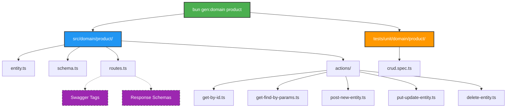
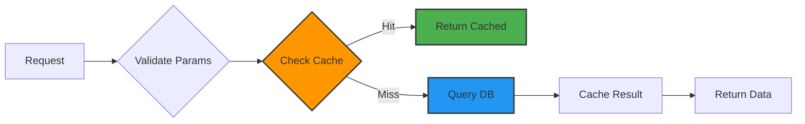
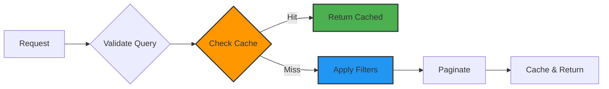
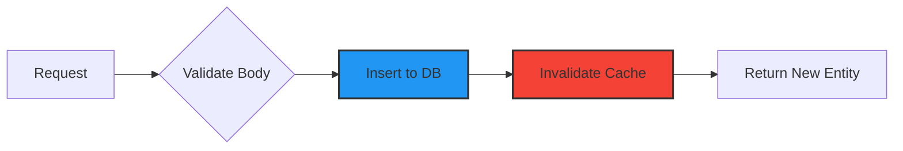
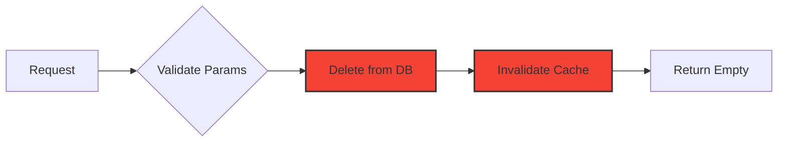

# Domain Scaffolding

To accelerate development and maintain consistency across domain modules, the project includes a CLI generator tool that creates complete CRUD domains in seconds. It also automatically registers the new routes and formats the code.

> **💡 Want to understand how the generator works internally?**  
> See [Template System Architecture](/development/template-system-architecture) for a deep dive into the zero-dependency template engine.

## How to use

Run the following command in your terminal:

::: code-group

```bash [bun]
bun gen:domain <name>
```

```bash [npm]
npm run gen:domain <name>
```

```bash [yarn]
yarn gen:domain <name>
```

```bash [pnpm]
pnpm gen:domain <name>
```

:::

Replace `<name>` with the singular name of your domain (e.g., `product`, `category`, `order`). The name will be used to:
- Create the domain folder structure
- Name the database table (e.g., `product` → table `product`)
- Generate proper imports and references
- Create Swagger tags with capitalized names (e.g., `Product`)

## Generated Structure

The tool automatically creates a **complete CRUD structure** following the project's architectural patterns:



### File Details

#### `entity.ts`
Drizzle ORM table definition with:
- Column definitions in a `columns` object
- Table creation with `identifier` (id, timestamps, activated)
- Index setup using `pgIndex`
- TypeScript type inference from table schema

#### `schema.ts`
Zod validation schemas for all operations:
- **headers**: Authentication headers
- **id**: UUID validation for params
- **read**: Query params with pagination support
- **create**: Body validation for POST
- **update**: Partial body validation for PUT
- **delete**: ID-only validation for DELETE

#### `routes.ts`
Fastify routes for complete REST API:
- `GET /ping` - Health check
- `GET /:id` - Retrieve single item (restricted)
- `GET /` - List with filters and pagination (restricted)
- `POST /` - Create new item (restricted)
- `PUT /:id` - Update item (restricted)
- `DELETE /:id` - Delete item (restricted)

#### Actions

### Actions Breakdown

#### 1. Retrieve Single Entity
**Endpoint:** `GET /:id`
**File:** `get-by-id.ts`
**Flow:**


#### 2. List Entities (Paginated)
**Endpoint:** `GET /`
**File:** `get-find-by-params.ts`
**Flow:**


#### 3. Create Entity
**Endpoint:** `POST /`
**File:** `post-new-entity.ts`
**Flow:**


#### 4. Update Entity
**Endpoint:** `PUT /:id`
**File:** `put-update-entity.ts`
**Flow:**


#### 5. Delete Entity
**Endpoint:** `DELETE /:id`
**File:** `delete-entity.ts`
**Flow:**


**Action Features:**
- **Validation**: All inputs validated with Zod schemas
- **Caching**: Redis-based caching with TTL (10 minutes)
- **Cache Invalidation**: Automatic cache clearing on mutations
- **Prepared Statements**: Optimized DB queries
- **Error Handling**: Proper HTTP status codes and i18n messages
- **Type Safety**: Full TypeScript inference

## Example Usage

```bash
bun gen:domain category
```

**Output:**
```
🚀 Generating domain: category...
🔗 Injected route into http-primary-webserver.ts

✅ Domain "category" generated successfully!

📂 Created Files:
   - src/domain/category/entity.ts
   - src/domain/category/schema.ts
   - src/domain/category/routes.ts
   - src/domain/category/actions/...
   - tests/unit/domain/category/crud.spec.ts

📍 Location: src/domain/category

👇 Next Steps:
   1. Review the generated schema in src/domain/category/schema.ts
   2. Run migration if necessary: bun run db:migrate
   3. Run tests: bun test tests/unit/domain/category/crud.spec.ts

🎨 Running formatter...
✨ Formatting complete!
```

### What's Created

- ✅ Complete REST API with 5 endpoints
- ✅ Database table with indexes
- ✅ Request/response validation
- ✅ Automatic caching layer
- ✅ Swagger documentation
- ✅ Test file skeleton
- ✅ Type-safe operations

### Next Steps After Generation

1. **Customize the entity**: Add more columns to `columns` object in `entity.ts`
2. **Enhance validation**: Add custom rules in `schema.ts`
3. **Write tests**: Implement actual test cases in `crud.spec.ts`
4. **Run migrations**: Generate and run Drizzle migrations

::: code-group

```bash [bun]
# Generate migration
bun db:migrate

# Apply to database
bun db:migrate:push
```

```bash [npm]
# Generate migration
npm run db:migrate

# Apply to database
npm run db:migrate:push
```

```bash [yarn]
# Generate migration
yarn db:migrate

# Apply to database
yarn db:migrate:push
```

```bash [pnpm]
# Generate migration
pnpm db:migrate

# Apply to database
pnpm db:migrate:push
```

:::

## Behavioral Notes

- **Naming Convention**: Use singular form (e.g., `product`, not `products`)
- **Table Names**: Automatically matches domain name
- **Cache Keys**: Generated using `tag()` helper with domain name
- **Idempotent**: Safe to re-run (will overwrite existing files)
- **Automatic Injection**: Routes are automatically registered in `http-primary-webserver.ts`
- **Auto-Formatting**: Runs `biome format` automatically after generation
- **No Conflicts**: Each domain is isolated in its own folder
