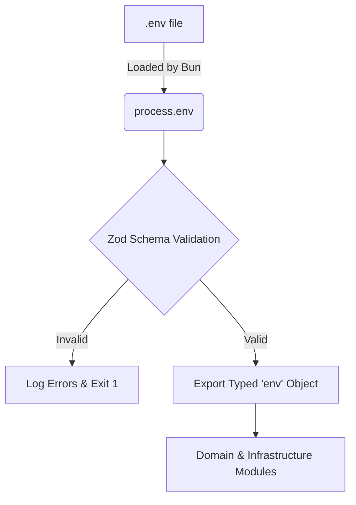

# Environment & Settings Configuration

The project uses a **Type-Safe** approach to environment variables. Instead of relying on `process.env` directly throughout the application, all variables are parsed, validated, and exported through a central configuration file using **Zod**.

This ensures that the application will **fail fast** at startup if any required configuration is missing or invalid, preventing unexpected runtime errors in production.

## How it Works

1. Variables are loaded from the `.env` file (built-in by Bun).
2. The `src/infrastructure/settings/environment.ts` file defines a Zod schema representing the expected environment state.
3. `process.env` is parsed against this schema.
4. If validation fails, the app prints clear error messages and exits.
5. If successful, it exports a strongly-typed `env` object.



## Adding a New Variable

When you need a new environment variable (e.g., `STRIPE_SECRET_KEY`), you **must** register it in the Zod schema.

**Step 1:** Add to `.env` and `.env.exemple`:
```env
STRIPE_SECRET_KEY=sk_test_12345
```

**Step 2:** Update the schema in `src/infrastructure/settings/environment.ts`:
```typescript
const schema = z.object({
  // ... existing variables
  STRIPE_SECRET_KEY: z.string().min(1),
});
```

**Step 3:** Use it securely anywhere in your code:
```typescript
import { env } from "@infrastructure/settings/environment";

const stripe = new Stripe(env.STRIPE_SECRET_KEY); 
// Autocomplete works, and TypeScript knows it's a string!
```

> [!TIP]
> **Coercion:** Zod allows you to coerce strings from `.env` into their actual types. For example, `z.coerce.number()` transforms the string "3000" into the number `3000`, and `.transform((val) => val === "true")` creates a boolean.

---

## Security Settings

Beyond environment variables, the `settings/` folder controls the primary security boundaries of the Fastify server.

### CORS (`cors.ts`)
Cross-Origin Resource Sharing is strictly configured based on the environment:
- In `development`, it allows all origins.
- In `production`, it strictly checks the incoming origin against the comma-separated list defined in `PROCESS_CORS_ORIGIN`.

If you need a new application to consume this API, add its URL to the `.env`:
```env
PROCESS_CORS_ORIGIN=https://myapp.com,https://admin.myapp.com
```

### Helmet (`helmet.ts`)
We use `@fastify/helmet` to automatically set secure HTTP headers. Key configurations include:
- `xPoweredBy: false`: Hides the technology stack.
- `Content-Security-Policy (CSP)`: Strictly defined to only allow scripts and styles from trusted sources (like `self` and Swagger UI CDNs), minimizing XSS risks.
- `xFrameOptions: "deny"`: Prevents clickjacking by disallowing the API or its docs from being embedded in an iframe.

> [!WARNING]
> If you are adding third-party scripts or changing how your Swagger UI is hosted, you might need to adjust the CSP directives in `helmet.ts` to allow those specific CDNs.
