# Template System Architecture

The boilerplate includes a **powerful, zero-dependency template engine** that generates complete CRUD domains in seconds. Unlike traditional code generators that use string concatenation or external libraries, this system uses **native TypeScript files as templates** with intelligent placeholder replacement.

## Overview

The template system is designed with three core principles:
1. **Zero Dependencies**: No external template libraries (Handlebars, EJS, etc.)
2. **Developer Experience**: Templates are valid TypeScript files with full IDE support
3. **Extensibility**: Easy to add new generators (Auth, WebSockets, etc.)

## Architecture


## Template Directory Structure

Templates are organized in `src/templates/domain/` and mirror the output structure:

```
src/templates/domain/
├── entity.ts              # Database table definition
├── schema.ts              # Zod validation schemas
├── routes.ts              # Fastify route handlers
└── actions/
    ├── get-by-id.ts       # Find by ID action
    ├── get-find-by-params.ts  # Search with filters
    ├── post-new-entity.ts     # Create new record
    ├── put-update-entity.ts   # Update existing
    └── delete-entity.ts       # Delete record
```

## Why TypeScript Templates?

Instead of using `.hbs` or `.ejs` files (which require extensions for syntax highlighting), we use **valid TypeScript files** with special placeholders.

### Before (Template)
```typescript
// src/templates/domain/entity.ts
const __name__ = pgTable("__name__", { ...columns, ...identifier });
export default __name__;
```

### After Generation
```typescript
// src/domain/pokemon/entity.ts (after bun gen:domain pokemon)
const pokemon = pgTable("pokemon", { ...columns, ...identifier });
export default pokemon;
```

### Benefits

| Feature | TypeScript Templates | Traditional (.hbs/.ejs) |
|---------|---------------------|------------------------|
| **Syntax Highlighting** | ✅ Native in IDE | ❌ Requires extension |
| **Auto-formatting** | ✅ Biome/Prettier works | ❌ Manual formatting |
| **Type Checking** | ✅ Catch errors early | ❌ Runtime errors only |
| **Dependencies** | ✅ Zero | ❌ Requires library |
| **Learning Curve** | ✅ Just TypeScript | ⚠️ New syntax to learn |

## Generation Flow

```mermaid
sequenceDiagram
    participant User
    participant CLI as generate-domain.ts
    participant Templates as Template Files
    participant FS as File System
    participant Webserver as http-primary-webserver.ts
    
    User->>CLI: bun gen:domain pokemon
    CLI->>Templates: Load all .ts templates
    Templates-->>CLI: Return template content
    CLI->>CLI: Replace __name__ → pokemon<br/>Replace __Capitalized__ → Pokemon
    CLI->>FS: Write entity.ts
    CLI->>FS: Write schema.ts
    CLI->>FS: Write routes.ts
    CLI->>FS: Write 5 action files
    CLI->>Webserver: Inject import & register route
    CLI->>CLI: Run biome format
    CLI-->>User: ✅ Domain "pokemon" generated!
```



## Placeholder System

The template engine uses a simple regex-based replacement:

| Placeholder | Example Input | Output | Usage |
|-------------|---------------|--------|-------|
| `__name__` | `pokemon` | `pokemon` | Variable names, table names, lowercase references |
| `__Capitalized__` | `pokemon` | `Pokemon` | Class names, display labels, OpenAPI tags |

### Implementation

The entire rendering engine is just 3 lines of code:

```typescript
const render = (content: string, vars: Record<string, string>) =>
  content
    .replace(/__name__/g, vars.name)
    .replace(/__Capitalized__/g, vars.capitalized);
```

**Why this works:**
- `__name__` is a valid JavaScript identifier (no syntax errors)
- Global regex replacement (`/g` flag) handles all occurrences
- No parsing or AST manipulation needed

## What Gets Generated

Running `bun gen:domain product` creates a complete, production-ready CRUD module:

```mermaid
graph TD
    A[bun gen:domain product] --> B[src/domain/product/]
    B --> C[entity.ts<br/>📦 Drizzle table schema]
    B --> D[schema.ts<br/>✅ Zod validation]
    B --> E[routes.ts<br/>🛣️ 5 REST endpoints]
    B --> F[actions/<br/>⚡ CRUD logic]
    
    F --> F1[get-by-id.ts]
    F --> F2[get-find-by-params.ts]
    F --> F3[post-new-entity.ts]
    F --> F4[put-update-entity.ts]
    F --> F5[delete-entity.ts]
    
    E --> G[Auto-registered in<br/>http-primary-webserver.ts]
    
    style A fill:#FF9800,color:#fff
    style G fill:#4CAF50,color:#fff
```



### Generated Files

- **`entity.ts`**: Drizzle ORM table definition with columns, indexes, and types
- **`schema.ts`**: Zod schemas for validation (create, update, read, delete)
- **`routes.ts`**: 5 Fastify routes (GET, POST, PUT, DELETE) with OpenAPI docs
- **`actions/`**: Business logic for each operation with caching and error handling

## Automatic Route Registration

The generator intelligently injects the new routes into your webserver:

**Before:**
```typescript
// src/functions/http-primary-webserver.ts
import userRoutes from "@domain/user/routes";

const server = await webserver.create();
server.register(userRoutes, { prefix: "/api/v1/users" });
```

**After `bun gen:domain pokemon`:**
```typescript
// src/functions/http-primary-webserver.ts
import userRoutes from "@domain/user/routes";
import pokemonRoutes from "@domain/pokemon/routes";  // ← Auto-added

const server = await webserver.create();
server.register(userRoutes, { prefix: "/api/v1/users" });
server.register(pokemonRoutes, { prefix: "/api/v1/pokemons" });  // ← Auto-added
```

### Injection Algorithm

The generator uses a simple string manipulation approach:

1. **Find last import**: Search for `lastIndexOf("import ")`
2. **Insert new import**: Add after the last import line
3. **Find last register**: Search for `lastIndexOf("server.register(")`
4. **Insert new register**: Add after the last register call

This approach is:
- ✅ Simple and reliable
- ✅ Doesn't require AST parsing
- ✅ Works with any code style
- ⚠️ Assumes consistent patterns (which the boilerplate enforces)

## Extending the Template System

The architecture is designed to scale from simple CRUD to complex plugin systems.

### Adding New Generators

Want to add authentication or WebSocket support? Just create new templates:

```bash
src/templates/
├── domain/          # Existing CRUD templates
├── auth/            # New: Authentication templates
│   ├── middleware.ts
│   ├── jwt-service.ts
│   └── routes.ts
└── websocket/       # New: WebSocket templates
    ├── handler.ts
    └── events.ts
```

Then create a new generator command:

```typescript
// src/commands/generate-auth.ts
const templates = {
  middleware: await loadTemplate("auth/middleware.ts"),
  service: await loadTemplate("auth/jwt-service.ts"),
  routes: await loadTemplate("auth/routes.ts"),
};

// Render and write files...
```

### Using Anchors for Complex Injection

For more complex scenarios (like injecting middleware into existing files), use **comment anchors**:

```typescript
// src/functions/http-primary-webserver.ts
const server = await webserver.create();

// [CLI:Inject_Middleware]
// Generators can search for this comment and inject code below it

server.register(userRoutes, { prefix: "/api/v1/users" });
```

Generator code:
```typescript
const anchorIndex = content.indexOf("// [CLI:Inject_Middleware]");
const insertPoint = content.indexOf("\n", anchorIndex) + 1;
content = content.slice(0, insertPoint) + newMiddleware + content.slice(insertPoint);
```

## Best Practices

### Template Design

1. **Keep templates valid TypeScript**: Ensures IDE support and type checking
2. **Use descriptive placeholders**: `__name__` is clear, `__x__` is not
3. **Include comments**: Explain complex logic in templates
4. **Test templates**: Generate a test domain and verify output

### Generator Design

1. **Validate input**: Check domain name format before generation
2. **Handle errors gracefully**: What if file already exists?
3. **Provide feedback**: Show what was created and next steps
4. **Auto-format output**: Always run Biome after generation

### Maintenance

1. **Version templates**: Consider git-tagging template versions
2. **Document changes**: Update this Wiki when templates change
3. **Test after updates**: Regenerate a test domain after template edits

## Troubleshooting

### Templates not found

**Error:** `ENOENT: no such file or directory`

**Solution:** Ensure templates exist in `src/templates/domain/`

### Placeholder not replaced

**Error:** Generated file contains `__name__` instead of actual name

**Solution:** Check the `render()` function is being called with correct variables

### Route not auto-injected

**Error:** New domain works but route not in webserver

**Solution:** Verify `http-primary-webserver.ts` follows expected pattern (imports at top, registers after `webserver.create()`)

## Future Enhancements

Potential improvements to the template system:

1. **Interactive Mode**: Prompt for column types during generation
2. **Template Variants**: Choose between REST, GraphQL, or gRPC templates
3. **Custom Hooks**: Allow users to define pre/post generation scripts
4. **Template Marketplace**: Share community templates
5. **Migration Generator**: Auto-generate Drizzle migrations from templates

---

**See Also:**
- [Domain Scaffolding (Generator)](/development/domain-scaffolding) - How to use the generator
- [Architecture](/architecture/) - Overall project structure
- [Best Practices](/development/best-practices) - Coding standards
