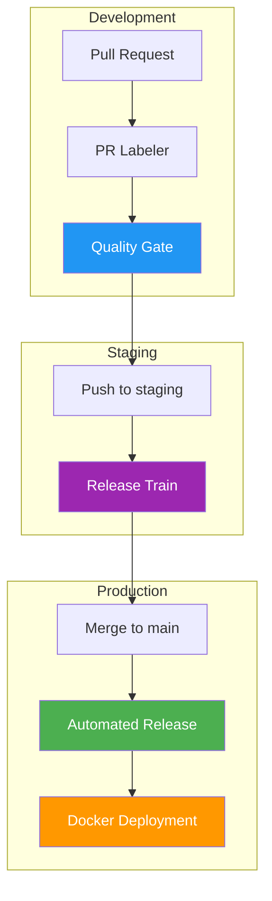
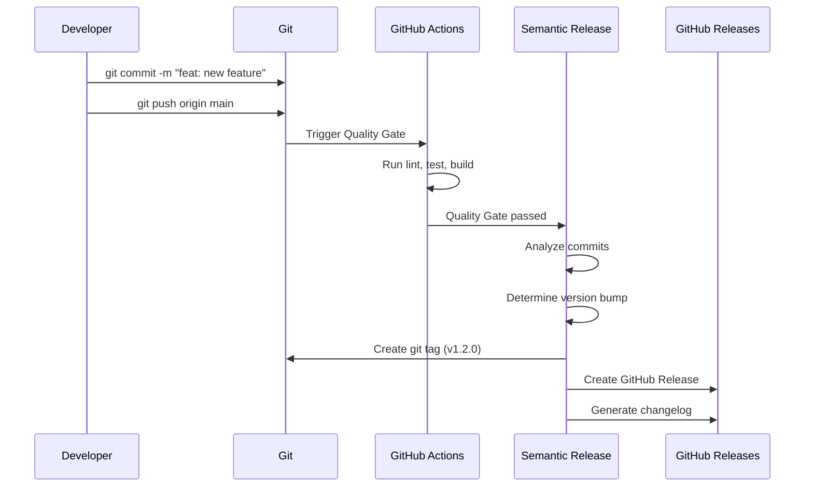

# CI/CD Pipeline

This boilerplate comes with a fully configured **GitHub Actions** pipeline to ensure code quality and automate deployments. The pipeline is designed to be zero-configuration for public repositories and provides a complete DevOps workflow out of the box.

## Overview

The CI/CD system follows a **Release Train** model using a `staging` branch for stabilization before production:



## Workflows

### 1. Quality Gate (`ci.yml`)

**Purpose:** Enforce code quality standards before merging

**Triggers:**
- Every `push` to `main` or `staging` branches
- Every `pull_request` targeting `main` or `staging`

**Optimization:**
- **Concurrency:** Includes a `concurrency` group to cancel redundant runs.
- **Caching:** Uses `actions/cache` to cache `bun` dependencies (`~/.bun/install/cache`), significantly reducing install times.

**Jobs:**

#### Lint
```yaml
- name: Lint Check
  run: bun run lint:check
```
Checks code style using Biome. Ensures consistent formatting and catches common errors.

#### Test
```yaml
- name: Run Tests
  run: bun run tests
```
Runs the full test suite with coverage reporting.

#### Build
```yaml
- name: Build Project
  run: bun run build
```
Verifies the project builds successfully for production.

**Configuration:**
```yaml
# .github/workflows/ci.yml
name: Quality Gate

on:
  push:
    branches: [main, staging]
  pull_request:
    branches: [main, staging]

concurrency:
  group: ${{ github.workflow }}-${{ github.head_ref || github.ref_name }}
  cancel-in-progress: true

jobs:
  lint:
    runs-on: ubuntu-latest
    steps:
      - uses: actions/checkout@v4
      - uses: oven-sh/setup-bun@v2
      - name: Cache dependencies
        uses: actions/cache@v4
        with:
          path: ~/.bun/install/cache
          key: ${{ runner.os }}-bun-${{ hashFiles('**/bun.lock') }}
      - run: bun install
      - run: bun run lint:check
# ... (similar for test and build)
```

### 2. PR Labeler (`labeler.yml`)

**Purpose:** Automatically categorize Pull Requests based on the files they modify.

**What it does:**
- Assigns labels like `feat`, `fix`, `docs`, `ci`, etc., automatically.
- Helps maintainers quickly understand the scope of a PR.
- Syncs labels if file changes are added to the PR.

### 3. Release Train (`release-train.yml`)

**Purpose:** Automate the stabilization process between `staging` and `main` branches.

**Triggers:**
- Scheduled (Weekly on Mondays)
- Manual trigger (Workflow Dispatch)

**What it does:**
- Checks for differences between `staging` and `main`.
- Generates a release body summarizing commits.
- Validates permissions and uses `gh pr create` to safely open a PR without overwriting branch history.

### 4. Automated Release (`release.yml`)

**Purpose:** Automatically version, tag, and release based on commit messages

**Triggers:**
- After Quality Gate passes on `main`
- Uses `workflow_run` to ensure sequential execution

**Tool:** [Semantic Release](https://semantic-release.gitbook.io/)

**How it works:**



**Commit Message Format:**

Uses [Conventional Commits](https://www.conventionalcommits.org/):

| Type | Version Bump | Example |
|------|-------------|---------|
| `feat:` | Minor (1.0.0 → 1.1.0) | `feat: add user authentication` |
| `fix:` | Patch (1.0.0 → 1.0.1) | `fix: resolve login bug` |
| `BREAKING CHANGE:` | Major (1.0.0 → 2.0.0) | `feat!: redesign API` |
| `docs:`, `chore:` | No release | `docs: update README` |

**Configuration:**

```json
// package.json
{
  "release": {
    "branches": ["main"],
    "plugins": [
      "@semantic-release/commit-analyzer",
      "@semantic-release/release-notes-generator",
      ["@semantic-release/npm", { "npmPublish": false }],
      "@semantic-release/github"
    ]
  }
}
```

> **Note:** `npmPublish: false` disables npm publishing. This boilerplate is not published to npm by default. Remove this option if you want to publish packages.

### 3. Docker Deployment (`deploy-docker.yml`)

**Purpose:** Build and push Docker images to GitHub Container Registry (GHCR)

**Triggers:**
- When a new GitHub Release is published

**What it does:**
1. Builds Docker image from `Dockerfile`
2. Tags image with release version
3. Pushes to `ghcr.io/<username>/<repo>`

**Configuration:**

```yaml
# .github/workflows/deploy-docker.yml
name: Docker Deployment

on:
  release:
    types: [published]

env:
  REGISTRY: ghcr.io
  IMAGE_NAME: ${{ github.repository }}

jobs:
  build-and-push:
    runs-on: ubuntu-latest
    permissions:
      contents: read
      packages: write

    steps:
      - uses: actions/checkout@v4
      
      - name: Log in to GHCR
        uses: docker/login-action@v3
        with:
          registry: ${{ env.REGISTRY }}
          username: ${{ github.actor }}
          password: ${{ secrets.GITHUB_TOKEN }}
      
      - name: Build and push
        uses: docker/build-push-action@v5
        with:
          context: .
          push: true
          tags: |
            ${{ env.REGISTRY }}/${{ env.IMAGE_NAME }}:latest
            ${{ env.REGISTRY }}/${{ env.IMAGE_NAME }}:${{ github.ref_name }}
```

**Pulling the image:**
```bash
docker pull ghcr.io/<username>/<repo>:latest
```

## Local Quality Checks

Before pushing, it is recommended to run local checks. This project uses **Client-side Git Hooks** managed by **Lefthook**.

**Hooks Enforced (`lefthook.yml`):**
1. **Pre-commit:** Runs `biome check --write` on staged files. Applies formatting fixes automatically.
2. **Pre-push:** Runs `bun test` to ensure tests pass before pushing to remote.

**Manual Commands:**

```bash
# Check code style manually
bun run lint:check

# Run tests manually
bun run tests

# Verify build
bun run build
```

## Troubleshooting

### Quality Gate Failing

#### Lint Errors

**Error:** `Found X errors`

**Solution:**
```bash
# Auto-fix most issues
bunx biome check --write .

# Check what's wrong
bun run lint:check
```

#### Test Failures

**Error:** `X tests failed`

**Solution:**
```bash
# Run tests locally
bun test

# Run specific test
bun test tests/unit/domain/user/user-get-by-id.spec.ts

# Run with watch mode
bun test --watch
```

#### Build Errors

**Error:** `Build failed`

**Solution:**
```bash
# Check TypeScript errors
bun run build

# Clear cache and rebuild
rm -rf dist && bun run build
```

### Release Not Triggering

**Problem:** Pushed to main but no release created

**Possible causes:**

1. **Commit message doesn't follow convention**
   ```bash
   # ❌ Wrong
   git commit -m "added new feature"
   
   # ✅ Correct
   git commit -m "feat: add user authentication"
   ```

2. **Quality Gate failed**
   - Check Actions tab for errors
   - Fix issues and push again

3. **No releasable commits**
   - `docs:` and `chore:` don't trigger releases
   - Need at least one `feat:` or `fix:` commit

### Docker Push Failing

**Error:** `denied: permission_denied`

**Solution:**
1. Enable GitHub Packages in repository settings
2. Ensure `GITHUB_TOKEN` has `packages: write` permission
3. Make repository public or configure package visibility

## Advanced Configuration

### Custom Release Rules

Modify `package.json` to customize release behavior:

```json
{
  "release": {
    "branches": ["main", "next"],
    "plugins": [
      ["@semantic-release/commit-analyzer", {
        "releaseRules": [
          {"type": "docs", "release": "patch"},
          {"type": "refactor", "release": "patch"},
          {"scope": "no-release", "release": false}
        ]
      }]
    ]
  }
}
```

### Deploy to Multiple Registries

Push to both GHCR and Docker Hub:

```yaml
- name: Log in to Docker Hub
  uses: docker/login-action@v3
  with:
    username: ${{ secrets.DOCKERHUB_USERNAME }}
    password: ${{ secrets.DOCKERHUB_TOKEN }}

- name: Build and push
  uses: docker/build-push-action@v5
  with:
    push: true
    tags: |
      ghcr.io/${{ github.repository }}:latest
      ${{ secrets.DOCKERHUB_USERNAME }}/myapp:latest
```

### Add Deployment Environments

Deploy to staging/production after release:

```yaml
# .github/workflows/deploy-production.yml
on:
  release:
    types: [published]

jobs:
  deploy:
    runs-on: ubuntu-latest
    environment: production
    steps:
      - name: Deploy to production
        run: |
          # Your deployment script
          ssh user@server 'docker pull ghcr.io/...'
```

## Best Practices

1. **Write good commit messages**: Follow Conventional Commits strictly
2. **Run checks locally**: Don't rely solely on CI
3. **Keep workflows fast**: Parallel jobs when possible
4. **Monitor Actions usage**: GitHub has monthly limits
5. **Secure secrets**: Never commit credentials
6. **Test in branches**: Use feature branches and PRs


**See Also:**
- [Deployment](/devops/deployment) - Production deployment guide
- [Testing Guide](/development/testing-guide) - Writing and running tests
- [Troubleshooting](/reference/troubleshooting) - Common issues and solutions
