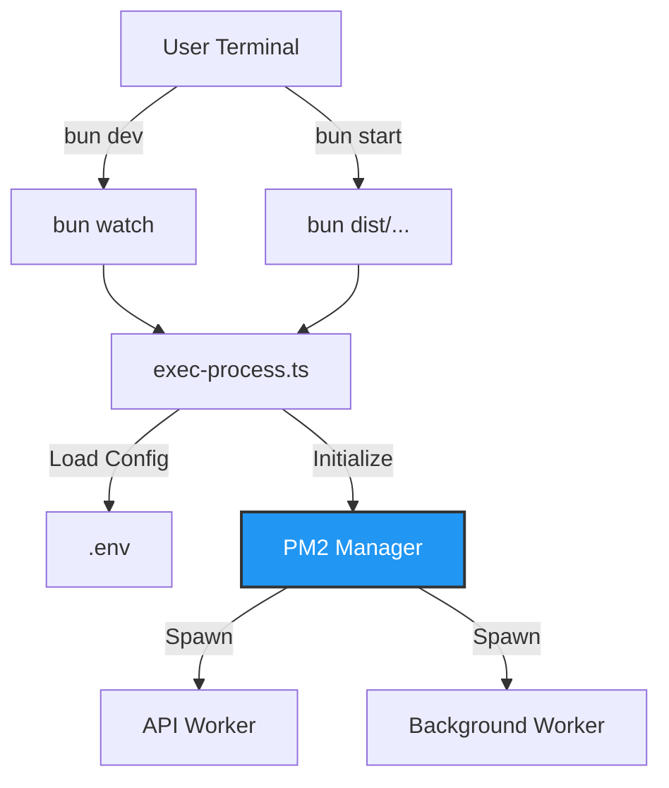

# Process Manager Reference

This document describes the functions available for executing and managing processes.

## Types
- **Workspace** _Settings for all workers_
- **Worker** _Process settings_

## Process Flow



## Worker configs: 
```typescript
export interface worker {
  tsx: string
  node: string
  bun: string
  name: string
  group: string
  activated: boolean
  heartbeat: string
  options: Omit<pm2.StartOptions, 'name' | 'script'>
}

const defaultConfigs: pm2.StartOptions = {
  force: true,
  max_restarts: 5,
  exec_mode: 'fork',
  autorestart: true,
  interpreter: 'bun',
  max_memory_restart: '100M',
  ignore_watch: ['node_modules'],
}
```

## Methods: 
```typescript
  dev: Promise<void>
  start: Promise<void>
```

### dev 
_bun --watch src/commands/exec-process.ts_ 
`Returns: Promise void.`

The `bun` runner will watch the project files for any changes and automatically restart the process using the entry point `exec-process.ts`. In development mode, the system efficiently manages worker processes, ensuring that file changes trigger immediate reloads and that all child processes are properly cleaned up on exit (SIGINT/SIGTERM support).

**Parameters**
```command
--workers={nameworker}
--group={namegroup}
```

**Detail**

- **bun**: The high-performance runtime and package manager used.

- **watch**: Instructs the runner to observe the project files and automatically restart.

- **workers**: Starts a specific worker by name (e.g., `primary-webserver`).

- **group**: Starts all workers belonging to a group (e.g., `primary`).

Example:
```command
 bun dev --workers=primary-webserver
 bun dev --group=primary
```

### start
_bun dist/commands/exec-process.js_ 
`Returns: Promise void.`

Runs the process in production mode using the Bun runtime and the pre-built files.

**Parameters**
```command
--workers={nameworker}
--group={namegroup}
```

Example:
```command
 bun start --group=primary
 bun start # Falls back to --group=primary automatically if no group/worker specified
```

> For the 'start' command to work, you must first carry out the 'build' process:
> ```command
>  bun build
> ```

If neither the 'workers' nor the 'group' parameter is defined in production, it will automatically fallback to `--group=primary`.
