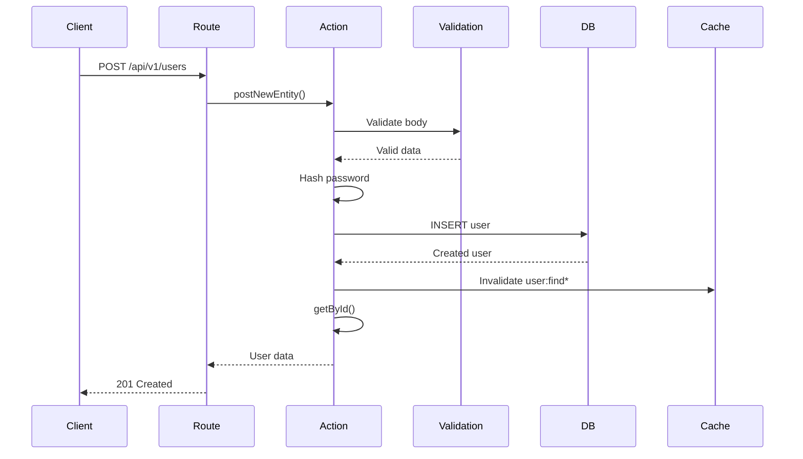
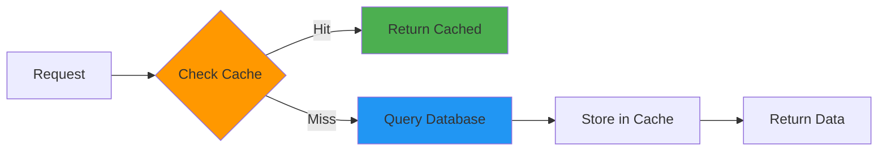

# API Example

This example demonstrates the complete data flow when creating a User domain, showing how all architectural layers work together. We'll walk through each file and explain how they interact.

## Overview

We'll create a complete User management system with:
- Database table definition
- Validation schemas
- REST API endpoints (CRUD)
- Business logic with caching
- Type-safe operations

## Step 1: Generate the Domain

::: code-group
```bash [bun]
bun gen:domain user
```
:::

::: tip 
This creates the complete structure. Let's examine each generated file.
:::

## Step 2: Understanding the Generated Files

### 2.1 Entity Definition (`src/domain/user/entity.ts`)

The entity defines the database table structure using Drizzle ORM:

```typescript
import { identifier, pgIndex } from "@infrastructure/repositories/references";
import { pgTable, varchar } from "drizzle-orm/pg-core";

const columns = {
  name: varchar("name", { length: 50 }).notNull(),
  lastName: varchar("lastName", { length: 100 }),
  email: varchar("email", { length: 400 }).unique().notNull(),
  password: varchar("password", { length: 100 }).notNull(),
};

const user = pgTable(
  "user", 
  { ...columns, ...identifier }, 
  (table) => pgIndex("user", table, ["name", "email"])
);

type user = typeof user.$inferSelect;

export default user;
```

**Key Points:**
- `columns`: Custom fields for your domain
- `identifier`: Adds `id`, `createdAt`, `updatedAt`, `activated` (from infrastructure)
- `pgIndex`: Creates database index for performance
- Type inference: TypeScript type automatically derived from schema

### 2.2 Validation Schemas (`src/domain/user/schema.ts`)

Zod schemas for runtime validation:

```typescript
import { withPagination, zodIdentifier } from "@infrastructure/repositories/references";
import { headers } from "@infrastructure/server/interface";
import { createInsertSchema, createSelectSchema } from "drizzle-zod";
import { array, object } from "zod/v4";
import user from "./entity";

// Generate base schemas from Drizzle entity
const create = createInsertSchema(user, {
  name: (schema) => schema.min(1).max(50),
  email: (schema) => schema.email(),
  password: (schema) => schema.min(8),
});

const select = createSelectSchema(user, {
  ...zodIdentifier,
}).partial();

// Define action-specific schemas
const actions = {
  headers,
  id: select.pick({ id: true }).required(),
  read: object({
    ...select.omit({ id: true }).shape,
    ...withPagination.shape,
  }),
  create: create.omit({ id: true }),
  update: create.omit({ id: true }).partial(),
  delete: create.pick({ id: true }),
};

export default { actions, entity: array(select) };
```

**Key Points:**
- `createInsertSchema`: Generates Zod schema from Drizzle table
- Custom validation: Override default rules (e.g., email format, password length)
- Action schemas: Separate schemas for each operation
- Type-safe: Full TypeScript inference

### 2.3 Routes Definition (`src/domain/user/routes.ts`)

Fastify routes with OpenAPI documentation:

```typescript
import request from "@infrastructure/server/request";
import type { FastifyInstance } from "fastify";
import deleteEntity from "./actions/delete-entity";
import getById from "./actions/get-by-id";
import getFindByParams from "./actions/get-find-by-params";
import postNewEntity from "./actions/post-new-entity";
import putUpdateEntity from "./actions/put-update-entity";
import schema from "./schema";

export default async function userRoutes(api: FastifyInstance) {
  api.get("/ping", { schema: { tags: ["User"] } }, (_, reply) => reply.code(200).send());

  api.get(
    "/:id",
    {
      schema: {
        tags: ["User"],
        summary: "Find user by id",
        params: schema.actions.id,
        headers: schema.actions.headers,
        response: { 200: schema.entity, ...request.reply.schemas },
      },
    },
    request.restricted(getById),
  );

  api.post(
    "/",
    {
      schema: {
        tags: ["User"],
        summary: "Create new user",
        body: schema.actions.create,
        headers: schema.actions.headers,
        response: { 201: schema.entity, ...request.reply.schemas },
      },
    },
    request.restricted(postNewEntity),
  );

  // ... PUT and DELETE routes
}
```

**Key Points:**
- `schema.tags`: Groups endpoints in Swagger UI
- `schema.params/body/headers`: Automatic validation
- `request.restricted()`: Applies authentication middleware
- `response`: Defines response schema for documentation

### 2.4 Business Logic (`src/domain/user/actions/post-new-entity.ts`)

Create user action with validation and caching:

```typescript
import cache from "@infrastructure/cache/actions";
import { hash, tag } from "@infrastructure/repositories/references";
import repository from "@infrastructure/repositories/repository";
import { container } from "@infrastructure/server/request";
import user from "../entity";
import { default as schema } from "../schema";
import getById from "./get-by-id";

export default async function postNewEntity(request: container) {
  request.status(201);

  // 1. Validate request body
  const validRequest = await schema.actions.create.safeParseAsync(request.body());
  if (!validRequest.success) {
    throw request.badRequest(request.language(), "post/user/{params}");
  }

  // 2. Hash password before storing
  const content = await repository
    .insert(user)
    .values({
      ...validRequest.data,
      password: hash(validRequest.data.password),
    })
    .onConflictDoNothing()
    .returning();

  // 3. Check if insert succeeded
  if (!content.length) {
    throw request.unprocessableEntity(request.language(), `post/user/${validRequest.data.email}`);
  }

  // 4. Invalidate cache (all user list queries)
  await cache.json.del(tag("user", "find*"));

  // 5. Return created user (fetched to ensure cache consistency)
  return getById(new container({ params: { id: content[0].id } }));
}
```

**Flow Diagram:**



## Step 3: Request Flow Example

Let's trace a complete request:

### Creating a User

**Request:**
```bash
curl -X POST http://localhost:3000/api/v1/users \
  -H "Content-Type: application/json" \
  -H "Authorization: Bearer token" \
  -d '{
    "name": "John",
    "lastName": "Doe",
    "email": "john@example.com",
    "password": "SecurePass123"
  }'
```

**What Happens:**

1. **Fastify receives request** → Routes to `userRoutes`
2. **Schema validation** → Validates body against `schema.actions.create`
3. **Authentication** → `request.restricted()` checks token
4. **Action execution** → Calls `postNewEntity()`
5. **Password hashing** → `hash()` encrypts password
6. **Database insert** → Drizzle ORM inserts record
7. **Cache invalidation** → Clears cached user lists
8. **Response** → Returns created user (201 status)

**Response:**
```json
{
  "id": "123e4567-e89b-12d3-a456-426614174000",
  "name": "John",
  "lastName": "Doe",
  "email": "john@example.com",
  "activated": true,
  "createdAt": "2024-01-01T00:00:00.000Z",
  "updatedAt": "2024-01-01T00:00:00.000Z"
}
```

### Retrieving a User

**Request:**
```bash
curl http://localhost:3000/api/v1/users/123e4567-e89b-12d3-a456-426614174000 \
  -H "Authorization: Bearer token"
```

**Flow with Caching:**



**Code (`get-by-id.ts`):**
```typescript
export default async function getById(request: container) {
  request.status(200);

  // Validate ID parameter
  const validRequest = await schema.actions.id.safeParseAsync(request.params());
  if (!validRequest.success) {
    throw request.badRequest(request.language(), tag("user", "find{id}"));
  }

  const { id } = validRequest.data;
  const reference = tag("user", "find{id}", { id });

  // Check cache first
  const cached = await cache.json.get<{ [key: string]: typeof user[] }>(reference);
  if (cached?.[reference]) return cached[reference];

  // Query database if not cached
  const prepare = repository
    .select()
    .from(user)
    .where(eq(user.id, sql.placeholder("id")))
    .limit(1)
    .orderBy(desc(user.id))
    .prepare("/user/id");

  const content = await prepare.execute({ id });

  if (!content.length) {
    throw request.notFound(request.language(), tag("user", "find{id}"));
  }

  // Cache for 10 minutes
  await cache.json.set(reference, content, 60 * 10);

  return content;
}
```

## Step 4: Customizing the Domain

### Adding Custom Fields

Edit `entity.ts`:
```typescript
const columns = {
  name: varchar("name", { length: 50 }).notNull(),
  lastName: varchar("lastName", { length: 100 }),
  email: varchar("email", { length: 400 }).unique().notNull(),
  password: varchar("password", { length: 100 }).notNull(),
  // Add new fields
  phoneNumber: varchar("phoneNumber", { length: 20 }),
  role: varchar("role", { length: 20 }).default("user"),
  isVerified: boolean("isVerified").default(false),
};
```

### Enhancing Validation

Edit `schema.ts`:
```typescript
const create = createInsertSchema(user, {
  name: (schema) => schema.min(1).max(50),
  email: (schema) => schema.email(),
  password: (schema) => schema.min(8).regex(/^(?=.*[A-Z])(?=.*[0-9])/),
  // Add custom validation
  phoneNumber: (schema) => schema.regex(/^\+?[1-9]\d{1,14}$/),
  role: (schema) => schema.enum(["user", "admin", "moderator"]),
});
```

### Running Migrations

After modifying the entity:

```bash
# Generate migration
bun db:migrate

# Apply to database
bun db:migrate:push
```

## Step 5: Testing the Domain

Write tests for your actions:

```typescript
// tests/unit/domain/user/user-create.spec.ts
import { describe, it, expect, beforeEach } from "bun:test";
import { createUserBuilder } from "@tests/builders/user.builder";
import postNewEntity from "@domain/user/actions/post-new-entity";

describe("User Creation", () => {
  it("should create user with hashed password", async () => {
    const userData = createUserBuilder({ password: "PlainPassword123" });
    const result = await postNewEntity(mockRequest(userData));
    
    expect(result[0].password).not.toBe("PlainPassword123");
    expect(result[0].email).toBe(userData.email);
  });

  it("should reject invalid email", async () => {
    const userData = createUserBuilder({ email: "invalid-email" });
    await expect(postNewEntity(mockRequest(userData))).rejects.toThrow();
  });
});
```

## Architecture Benefits Demonstrated

This example shows:

1. **Separation of Concerns**: Entity, validation, routes, and logic are separate
2. **Type Safety**: Full TypeScript inference from database to API
3. **Caching**: Automatic Redis caching with invalidation
4. **Validation**: Request/response validation at multiple levels
5. **Documentation**: Auto-generated Swagger docs from schemas
6. **Testability**: Easy to mock and test each layer
7. **Scalability**: Add new domains without affecting existing ones